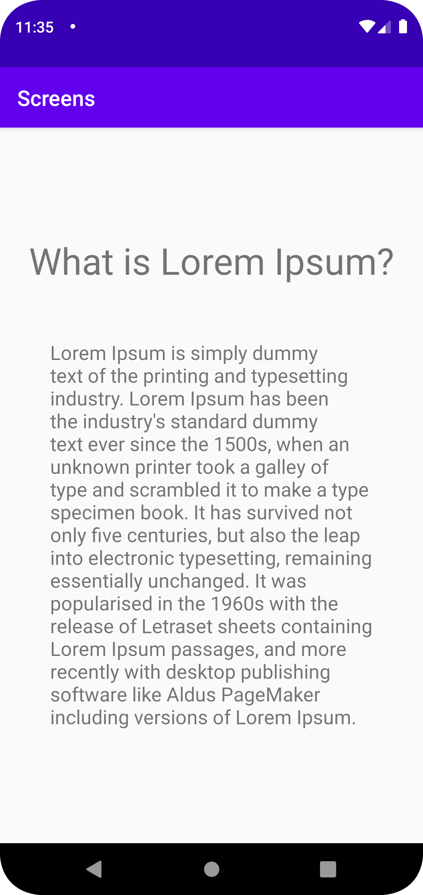

# Rapport

I uppgiften skapades en ny aktivitet med hjälp av en java-fil och en xml-fil.
MainActivity innehåller endast en TextView och en button. Användaren uppmanas att klicka på knappen för att skicka en intent med extras och gå till nästa screen.
Följande kod har implementerats för att knappen ska funka och flytta användaren till MainActivity2.

``` 
button = findViewById(R.id.button);
button.setOnClickListener(new View.OnClickListener(){

@Override
public void onClick(View view) {

    intent = new Intent(MainActivity.this, MainActivity2.class);
    intent.putExtra("lorem_ipsum", "Lorem Ipsum is simply dummy text of the printing and typesetting industry. Lorem Ipsum has been the industry's standard dummy text ever since the 1500s, when an unknown printer took a galley of type and scrambled it to make a type specimen book. It has survived not only five centuries, but also the leap into electronic typesetting, remaining essentially unchanged. It was popularised in the 1960s with the release of Letraset sheets containing Lorem Ipsum passages, and more recently with desktop publishing software like Aldus PageMaker including versions of Lorem Ipsum.");
    intent.putExtra("title", "What is Lorem Ipsum?");
    startActivity(intent);

}
```

I MainActivity2 tas intenten emot som en bundle där extras öppnas och tilldelas variablerna för respektive TextView på screenen.
```
Bundle extras = getIntent().getExtras();
if(extras != null){
    title = extras.getString("title");
    lorem = extras.getString("lorem_ipsum");
}

header.setText(title);
lorem_ipsum.setText(lorem);
```

Nedan bifogas en skärmdump på MainActivity2.

